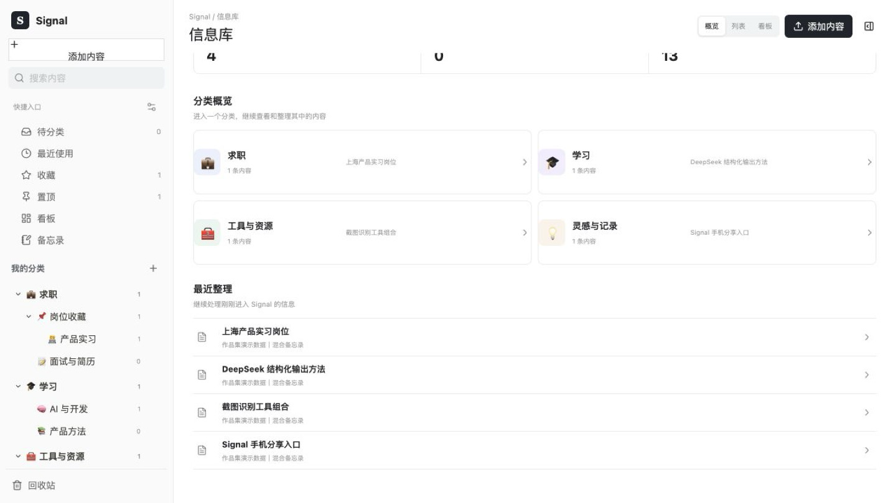
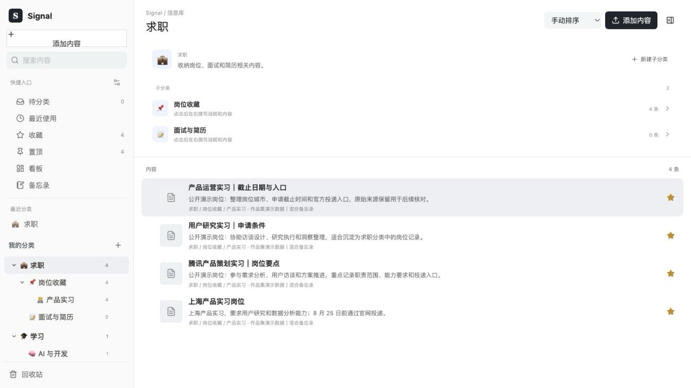
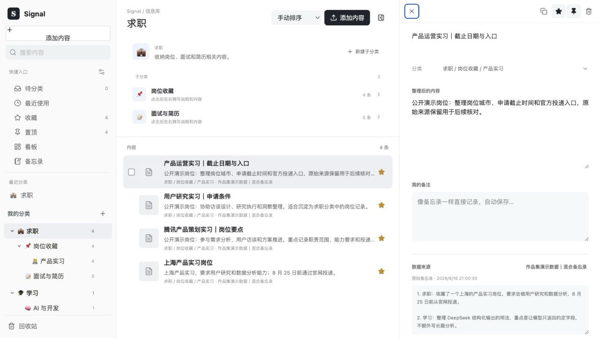
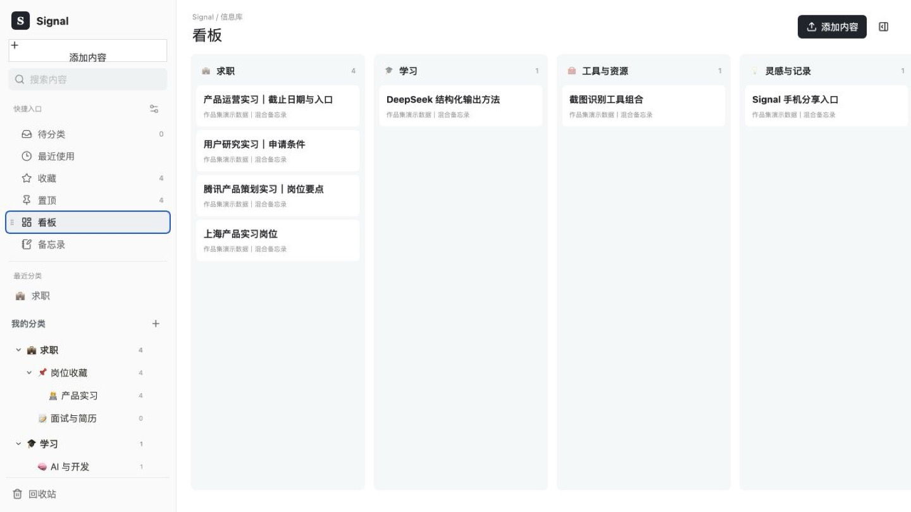
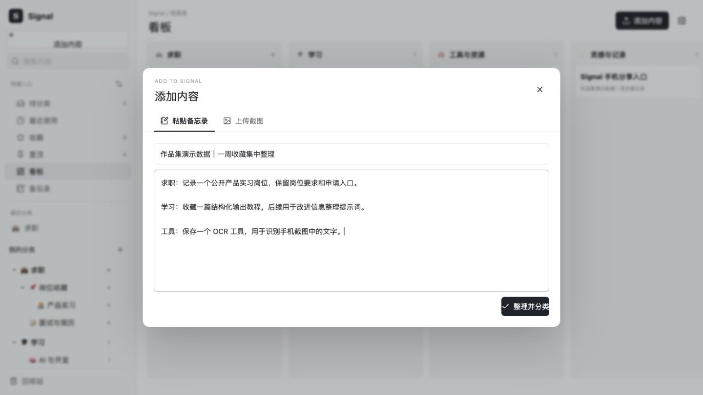

# Signal

一个本地优先的个人信息识别与分类工具。Signal 把散落在截图、收藏文字和混合备忘录里的内容轻度整理后放入用户自己的分类体系，并保留原始来源，方便日后查找和核对。



## 为什么做 Signal

收藏常常分散在小红书、抖音、牛客、招聘平台、网页和手机截图里；备忘录与 Notion 中也会积累大量零散信息。真正的问题不是缺少另一个收件箱，而是保存之后没有时间重新阅读、整理和利用。

Signal 只做一条尽量短的链路：

```text
截图 / 混合备忘录
→ 识别文字与原意
→ 轻度整理并匹配用户分类
→ 用户确认和修改
→ 保存内容、原文与来源
```

它不会替用户生成冗长分析，也不会把一条完整材料机械拆成互不相关的碎片。

## 当前能力

- 单张或批量上传 PNG、JPEG、WebP、HEIC、HEIF 截图。
- 浏览器内图片压缩与中英文 OCR。
- 粘贴包含多个主题的混合备忘录。
- 使用 DeepSeek 对文本进行轻度整理并匹配现有分类。
- 用户自建多级分类树，支持展开、折叠、重命名、移动、复制、拖拽和删除。
- 分类支持 Emoji、图标、颜色和收藏状态。
- 信息库列表、分类概览与看板视图。
- 内容搜索、排序、收藏、置顶、移动、复制、回收站与彻底删除。
- 三栏原地编辑，保留原始文本、来源名称、来源时间和截图原图。
- 内容和分类主要保存在当前浏览器，无需登录。

## 产品界面

| 分类树与内容列表 | 内容详情与来源溯源 |
| --- | --- |
|  |  |

| 分类看板 | 混合备忘录导入 |
| --- | --- |
|  |  |

截图中的内容均为隔离的作品集演示数据，不是真实用户数据或业务结果。

## 本地运行

需要 Node.js `>= 22.13.0`。

```bash
npm install
npm run dev -- --port 3001
```

打开 `http://localhost:3001/`。

构建与测试：

```bash
npm run build
npm test
```

## 数据与隐私边界

- Signal 是本地优先、单人自用的工具；内容、分类和图片主要保存在浏览器 `localStorage`。
- 不同浏览器与设备之间暂不自动同步。
- DeepSeek API Key 保存在使用者当前浏览器，不写入 Git 仓库。
- 进行 AI 整理时，浏览器会把 API Key、原始文本、标题和分类路径发送到项目的 `/api/analyze`，项目服务再转发给 DeepSeek。
- 截图 OCR 在浏览器内完成；发送给 DeepSeek 的是 OCR 后的文字，不是原始图片文件。
- 公开使用时请自行评估第三方模型服务的数据政策，不应理解为“所有数据永不离开本地”。

## 当前边界

- 暂不支持小红书、抖音、牛客、BOSS 直聘等平台收藏的自动抓取。
- 暂不支持网页或视频链接解析、音视频转写和跨设备同步。
- 图片存入 `localStorage`，大量截图可能触及浏览器容量上限。
- OCR 与分类效果尚未建立正式评测集，因此不提供虚构的准确率或效率数据。

更完整的产品能力、设计取舍与作品集说明见 [PORTFOLIO_HANDOFF.md](artifacts/portfolio/PORTFOLIO_HANDOFF.md)。

## 技术栈

React 19、TypeScript、vinext、Tesseract.js、DeepSeek API、Cloudflare Workers / Sites。
